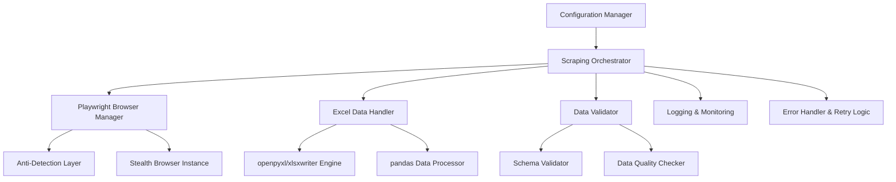

# Playwright Excel Web Scraper - Implementation Plan

**Created**: August 25, 2025  
**Project**: Python Web Scraping Automation with Playwright and Excel Integration  
**Target Platform**: Chrome on Windows 11

## Overview

This plan outlines the development of a robust, scalable Python application that uses Playwright for web scraping automation and Excel file manipulation. The solution will feature anti-detection measures, comprehensive error handling, and high data accuracy for production use.

## Requirements Analysis

### Functional Requirements
- ✅ **Web Scraping**: Automate reading information from specified web locations
- ✅ **Excel Integration**: Fill Excel files with accurate scraped data
- ✅ **Chrome Compatibility**: Optimized for Chrome browser on Windows 11
- ✅ **High Accuracy**: Implement data validation and verification mechanisms
- ✅ **Reliability**: Handle errors gracefully with retry mechanisms

### Non-Functional Requirements
- ✅ **Performance**: Handle large-scale scraping operations efficiently
- ✅ **Maintainability**: Clean, modular architecture with comprehensive logging
- ✅ **Configurability**: Flexible configuration management for different scraping targets
- ✅ **Anti-Detection**: Implement stealth measures to avoid bot detection
- ✅ **Scalability**: Support concurrent scraping operations

## Architecture Design

### System Architecture


### Core Components

1. **Configuration Management**
   - Pydantic-settings for type-safe configuration
   - Environment variables and YAML/JSON config files
   - Target URLs, selectors, and Excel template management

2. **Browser Management**
   - Playwright with Chrome browser engine
   - Stealth plugins and anti-detection measures
   - Session management and cookie handling

3. **Data Processing**
   - Web element extraction and parsing
   - Data validation and cleaning
   - Excel file creation and manipulation

4. **Quality Assurance**
   - Comprehensive error handling
   - Data accuracy validation
   - Logging and monitoring

## Technology Stack

### Core Dependencies
- **Python 3.11+**: Modern Python with enhanced performance
- **Playwright 1.40+**: Latest version with improved Windows support
- **pydantic-settings 2.0+**: Type-safe configuration management
- **openpyxl 3.1+**: Excel file read/write operations
- **pandas 2.1+**: Data manipulation and analysis
- **xlsxwriter 3.1+**: High-performance Excel writing
- **undetected-playwright-python**: Anti-detection enhancements

### Additional Libraries
- **loguru**: Advanced logging capabilities
- **tenacity**: Retry logic implementation
- **asyncio**: Asynchronous operations support
- **aiofiles**: Async file operations
- **python-dotenv**: Environment variable management
- **pyyaml**: YAML configuration support

## Project Structure

```
auto-scrape/
├── src/
│   ├── auto_scrape/
│   │   ├── __init__.py
│   │   ├── config/
│   │   │   ├── __init__.py
│   │   │   ├── settings.py          # Pydantic settings
│   │   │   └── schemas.py           # Data validation schemas
│   │   ├── browser/
│   │   │   ├── __init__.py
│   │   │   ├── manager.py           # Browser session management
│   │   │   ├── stealth.py           # Anti-detection measures
│   │   │   └── utils.py             # Browser utilities
│   │   ├── scraping/
│   │   │   ├── __init__.py
│   │   │   ├── orchestrator.py     # Main scraping coordinator
│   │   │   ├── extractors.py       # Data extraction logic
│   │   │   └── validators.py       # Data validation
│   │   ├── excel/
│   │   │   ├── __init__.py
│   │   │   ├── handler.py           # Excel file operations
│   │   │   ├── formatters.py       # Excel formatting
│   │   │   └── templates.py        # Excel template management
│   │   ├── utils/
│   │   │   ├── __init__.py
│   │   │   ├── logging.py          # Logging configuration
│   │   │   ├── retry.py            # Retry mechanisms
│   │   │   └── exceptions.py       # Custom exceptions
│   │   └── main.py                 # Application entry point
├── config/
│   ├── scraping_targets.yaml       # Scraping configuration
│   ├── excel_templates.yaml        # Excel template definitions
│   └── browser_settings.yaml       # Browser configuration
├── templates/
│   └── excel/                      # Excel template files
├── data/
│   ├── input/                      # Input Excel files
│   └── output/                     # Generated Excel files
├── logs/                           # Application logs
├── tests/
│   ├── unit/
│   ├── integration/
│   └── e2e/
├── requirements.txt
├── pyproject.toml
├── .env.example
├── .gitignore
└── README.md
```

## Implementation Steps

### Phase 1: Project Foundation and Setup
- [ ] **Task 1.1**: Initialize project structure and virtual environment
  - Create directory structure as defined above
  - Set up Python 3.11+ virtual environment
  - Initialize git repository with proper .gitignore

- [ ] **Task 1.2**: Install and configure dependencies
  - Install Playwright and browser engines
  - Install Excel manipulation libraries (openpyxl, pandas, xlsxwriter)
  - Install configuration management (pydantic-settings)
  - Install logging and utility libraries (loguru, tenacity)

- [ ] **Task 1.3**: Set up development environment
  - Configure IDE settings and code formatting (black, isort, mypy)
  - Set up pre-commit hooks for code quality
  - Create development and production environment files

### Phase 2: Configuration Management System
- [ ] **Task 2.1**: Implement Pydantic settings classes
  - Create base settings configuration with environment variable support
  - Implement browser settings (user agents, timeouts, proxy configurations)
  - Create scraping target configuration schema

- [ ] **Task 2.2**: Create configuration file structure
  - Design YAML configuration files for scraping targets
  - Create Excel template configuration system
  - Implement multi-environment configuration support

- [ ] **Task 2.3**: Add configuration validation
  - Implement schema validation for all configuration files
  - Add configuration loading and merging logic
  - Create configuration testing utilities

### Phase 3: Browser Management and Anti-Detection
- [ ] **Task 3.1**: Implement Playwright browser manager
  - Create browser session management with proper lifecycle
  - Configure Chrome browser with Windows 11 optimizations
  - Implement connection pooling and resource management

- [ ] **Task 3.2**: Add anti-detection measures
  - Integrate undetected-playwright-python library
  - Implement user agent rotation and browser fingerprint masking
  - Add request timing randomization and rate limiting

- [ ] **Task 3.3**: Create stealth browsing features
  - Implement proxy rotation support
  - Add CAPTCHA detection and handling strategies
  - Create browser behavior mimicking (mouse movements, scrolling)

### Phase 4: Web Scraping Engine
- [ ] **Task 4.1**: Build data extraction framework
  - Create flexible selector-based extraction system
  - Implement multi-element extraction with wait strategies
  - Add dynamic content handling (AJAX, lazy loading)

- [ ] **Task 4.2**: Implement scraping orchestrator
  - Create main scraping workflow coordinator
  - Add parallel scraping support for multiple targets
  - Implement session state management across pages

- [ ] **Task 4.3**: Add data validation and cleaning
  - Create data validation schemas using Pydantic
  - Implement data cleaning and normalization pipelines
  - Add data quality checks and accuracy verification

### Phase 5: Excel Integration System
- [ ] **Task 5.1**: Create Excel handler framework
  - Implement unified interface for openpyxl and xlsxwriter
  - Create template-based Excel file generation
  - Add dynamic worksheet and column management

- [ ] **Task 5.2**: Build data transformation pipeline
  - Integrate pandas for complex data manipulations
  - Create data mapping and transformation utilities
  - Implement cell formatting and styling systems

- [ ] **Task 5.3**: Add Excel template management
  - Create template loading and validation system
  - Implement dynamic template population
  - Add multi-sheet Excel file support

### Phase 6: Error Handling and Reliability
- [ ] **Task 6.1**: Implement comprehensive error handling
  - Create custom exception hierarchy
  - Add context-aware error messages and recovery
  - Implement graceful degradation strategies

- [ ] **Task 6.2**: Add retry and recovery mechanisms
  - Implement exponential backoff retry logic using tenacity
  - Create circuit breaker patterns for external dependencies
  - Add automatic recovery from network failures

- [ ] **Task 6.3**: Create logging and monitoring system
  - Configure structured logging with loguru
  - Add performance monitoring and metrics collection
  - Implement audit trails for data accuracy tracking

### Phase 7: Testing and Quality Assurance
- [ ] **Task 7.1**: Create unit test suite
  - Write comprehensive unit tests for all core modules
  - Add mock services for browser and Excel operations
  - Achieve >90% code coverage

- [ ] **Task 7.2**: Implement integration tests
  - Create end-to-end scraping workflow tests
  - Add Excel file generation and validation tests
  - Test error scenarios and recovery mechanisms

- [ ] **Task 7.3**: Add performance and load testing
  - Create performance benchmarks for scraping operations
  - Test concurrent scraping scenarios
  - Validate memory usage and resource cleanup

### Phase 8: Documentation and Deployment
- [ ] **Task 8.1**: Create comprehensive documentation
  - Write detailed README with setup instructions
  - Create configuration guide and examples
  - Document API reference and usage patterns

- [ ] **Task 8.2**: Add operational documentation
  - Create deployment guide for different environments
  - Document monitoring and troubleshooting procedures
  - Add performance tuning recommendations

- [ ] **Task 8.3**: Prepare production deployment
  - Create containerization with Docker
  - Add environment-specific configuration files
  - Create deployment automation scripts

## Configuration Management Strategy

### Environment-based Configuration
```yaml
# config/scraping_targets.yaml
targets:
  - name: "example_site"
    url: "https://example.com"
    selectors:
      title: "h1.main-title"
      description: ".content-description"
      price: ".price-value"
    wait_conditions:
      - selector: ".content-loaded"
        timeout: 30000
    output_mapping:
      excel_sheet: "Products"
      columns:
        A: "title"
        B: "description"
        C: "price"
```

### Browser Configuration
```python
# src/auto_scrape/config/settings.py
from pydantic_settings import BaseSettings
from typing import List, Optional

class BrowserSettings(BaseSettings):
    headless: bool = True
    user_agents: List[str] = [
        "Mozilla/5.0 (Windows NT 10.0; Win64; x64) AppleWebKit/537.36"
    ]
    viewport_width: int = 1920
    viewport_height: int = 1080
    timeout: int = 30000
    proxy_rotation: bool = False
    stealth_mode: bool = True
    
    class Config:
        env_prefix = "BROWSER_"
```

## Data Validation Strategy

### Pydantic Schemas for Data Validation
```python
# src/auto_scrape/config/schemas.py
from pydantic import BaseModel, HttpUrl, validator
from typing import Dict, Any, List

class ScrapedData(BaseModel):
    title: str
    description: Optional[str]
    price: Optional[float]
    url: HttpUrl
    scraped_at: datetime
    
    @validator('price')
    def validate_price(cls, v):
        if v is not None and v < 0:
            raise ValueError('Price must be non-negative')
        return v

class ExcelOutputMapping(BaseModel):
    sheet_name: str
    column_mappings: Dict[str, str]
    data_types: Dict[str, str]
    validation_rules: Dict[str, Any]
```

## Anti-Detection Implementation

### Stealth Features
- **User Agent Rotation**: Random selection from realistic user agent pool
- **Browser Fingerprint Masking**: Modify navigator properties and screen resolution
- **Request Timing**: Human-like delays between requests (1-5 seconds with jitter)
- **Proxy Support**: Rotate residential proxies for IP diversification
- **CAPTCHA Handling**: Detect CAPTCHA challenges and implement bypass strategies
- **Mouse Simulation**: Random mouse movements and click patterns

## Performance Optimization

### Concurrent Processing
- Implement async/await patterns for I/O operations
- Use browser instance pooling to reduce startup overhead
- Implement queue-based processing for large-scale scraping
- Add memory management and cleanup procedures

### Excel Performance
- Use xlsxwriter for large datasets (write-only operations)
- Use openpyxl for template-based modifications
- Implement streaming write operations for memory efficiency
- Add progress tracking for long-running operations

## Error Handling Strategy

### Exception Hierarchy
```python
class AutoScrapeException(Exception):
    """Base exception for auto-scrape application"""

class BrowserException(AutoScrapeException):
    """Browser-related exceptions"""

class ScrapingException(AutoScrapeException):
    """Data extraction exceptions"""

class ExcelException(AutoScrapeException):
    """Excel processing exceptions"""

class ValidationException(AutoScrapeException):
    """Data validation exceptions"""
```

### Retry Configuration
```python
from tenacity import retry, stop_after_attempt, wait_exponential

@retry(
    stop=stop_after_attempt(3),
    wait=wait_exponential(multiplier=1, min=4, max=10)
)
async def extract_data_with_retry(page, selector):
    """Retry data extraction with exponential backoff"""
    pass
```

## Testing Strategy

### Test Coverage Areas
1. **Unit Tests**: Individual component functionality
2. **Integration Tests**: Component interaction validation
3. **End-to-End Tests**: Complete workflow verification
4. **Performance Tests**: Load and stress testing
5. **Security Tests**: Anti-detection measure validation

### Test Data Management
- Create mock websites for testing scraping logic
- Use test Excel templates for validation
- Implement test data fixtures and factories
- Add regression test suites for bug prevention

## Security and Compliance

### Security Measures
- Never store credentials in code or configuration files
- Use environment variables for sensitive configuration
- Implement secure proxy authentication
- Add input validation to prevent injection attacks
- Create audit logs for compliance tracking

### Ethical Scraping Guidelines
- Respect robots.txt files and rate limits
- Implement polite crawling with appropriate delays
- Monitor server response times and adjust accordingly
- Add user-configurable rate limiting controls

## Monitoring and Observability

### Logging Strategy
- Structured logging with JSON format for log aggregation
- Different log levels for different environments
- Performance metrics logging (response times, success rates)
- Error tracking with stack traces and context

### Metrics Collection
- Scraping success/failure rates
- Data accuracy metrics
- Performance benchmarks
- Resource utilization monitoring

## Deployment Considerations

### Environment Requirements
- Python 3.11+ runtime
- Chrome browser installation
- Sufficient disk space for logs and Excel files
- Network access for target websites

### Scalability Planning
- Horizontal scaling with multiple worker instances
- Queue-based job distribution
- Database integration for large-scale operations
- Cloud deployment configurations

## Risk Assessment

### Technical Risks
- **Anti-bot measures**: Websites may implement advanced detection
  - *Mitigation*: Continuous updates to stealth measures and proxy rotation
- **Website changes**: Target sites may change structure
  - *Mitigation*: Flexible selector system and validation alerts
- **Performance issues**: Large-scale scraping may impact system resources
  - *Mitigation*: Resource monitoring and automatic scaling

### Business Risks
- **Data accuracy**: Incorrect data extraction could impact business decisions
  - *Mitigation*: Comprehensive validation and quality checks
- **Compliance issues**: Scraping may violate terms of service
  - *Mitigation*: Legal review and ethical scraping practices
- **Maintenance overhead**: Complex system may require ongoing maintenance
  - *Mitigation*: Clean architecture and comprehensive documentation

## Success Metrics

### Performance KPIs
- **Data Accuracy**: >99% accuracy rate for extracted data
- **Success Rate**: >95% successful scraping operations
- **Performance**: <5 seconds average response time per page
- **Reliability**: <1% error rate in production operations

### Quality Metrics
- **Code Coverage**: >90% unit test coverage
- **Documentation**: 100% API documentation coverage
- **Monitoring**: Real-time alerting for critical failures
- **Maintainability**: Clean code metrics and technical debt tracking

## TODO Checklist

### Phase 1: Foundation
- [ ] Create project structure and virtual environment
- [ ] Install and configure all dependencies
- [ ] Set up development environment and tools
- [ ] Initialize git repository with proper configurations

### Phase 2: Configuration System
- [ ] Implement Pydantic settings classes
- [ ] Create YAML configuration files
- [ ] Add configuration validation and testing

### Phase 3: Browser Management
- [ ] Build Playwright browser manager
- [ ] Implement anti-detection measures
- [ ] Add stealth browsing features

### Phase 4: Scraping Engine
- [ ] Create data extraction framework
- [ ] Build scraping orchestrator
- [ ] Add data validation and cleaning

### Phase 5: Excel Integration
- [ ] Create Excel handler framework
- [ ] Build data transformation pipeline
- [ ] Add template management system

### Phase 6: Error Handling
- [ ] Implement comprehensive error handling
- [ ] Add retry and recovery mechanisms
- [ ] Create logging and monitoring system

### Phase 7: Testing
- [ ] Create comprehensive unit test suite
- [ ] Implement integration and E2E tests
- [ ] Add performance and load testing

### Phase 8: Documentation and Deployment
- [ ] Create comprehensive documentation
- [ ] Add operational documentation
- [ ] Prepare production deployment configuration

---

## Next Steps

1. **Immediate Actions**:
   - Review and approve implementation plan
   - Set up development environment
   - Begin Phase 1 implementation

2. **Short-term Goals (Week 1-2)**:
   - Complete project foundation setup
   - Implement basic configuration management
   - Create initial browser management framework

3. **Medium-term Goals (Week 3-4)**:
   - Build core scraping functionality
   - Implement Excel integration
   - Add comprehensive error handling

4. **Long-term Goals (Week 5-6)**:
   - Complete testing and validation
   - Create documentation and deployment guides
   - Perform production readiness review

This implementation plan provides a roadmap for building a production-ready, scalable web scraping solution that meets all specified requirements while incorporating modern best practices for reliability, performance, and maintainability.