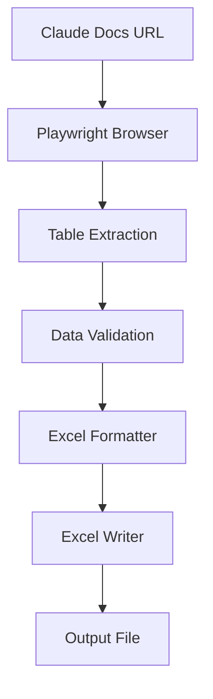

# Claude Code Essential Commands Table Extraction Plan

**Created:** 2025-08-26  
**Type:** Data Extraction & Excel Export  
**Priority:** High  

## Overview

This plan outlines the implementation for extracting the "Essential commands" table from the Claude Code quickstart documentation (https://docs.anthropic.com/en/docs/claude-code/quickstart) and saving it to an Excel file using the existing auto-scrape framework.

## Requirements

### Functional Requirements
- **FR1**: Extract the "Essential commands" table from Claude Code documentation
- **FR2**: Parse table data including Command, Description, and Example columns
- **FR3**: Export data to Excel format with proper formatting
- **FR4**: Handle potential page structure changes gracefully
- **FR5**: Provide detailed logging and error handling

### Non-Functional Requirements  
- **NFR1**: Complete extraction within 30 seconds
- **NFR2**: Handle network timeouts and retries
- **NFR3**: Maintain data integrity during extraction
- **NFR4**: Generate human-readable Excel output

## Architecture

### Data Flow


### Components
1. **Documentation Scraper**: Fetches and parses the Claude Code documentation
2. **Table Parser**: Extracts table data using CSS selectors
3. **Data Validator**: Ensures data completeness and accuracy
4. **Excel Formatter**: Formats data for Excel output
5. **Excel Writer**: Generates the final Excel file

## Research Findings

### Documentation Analysis
From the Claude Code quickstart documentation, the "Essential commands" table contains:

| Command | What it does | Example |
|---------|--------------|---------|
| `claude` | Start interactive mode | `claude` |
| `claude "task"` | Run a one-time task | `claude "fix the build error"` |
| `claude -p "query"` | Run one-off query, then exit | `claude -p "explain this function"` |
| `claude -c` | Continue most recent conversation | `claude -c` |
| `claude -r` | Resume a previous conversation | `claude -r` |
| `claude commit` | Create a Git commit | `claude commit` |
| `/clear` | Clear conversation history | `> /clear` |
| `/help` | Show available commands | `> /help` |
| `exit` or Ctrl+C | Exit Claude Code | `> exit` |

### Technical Stack
- **Web Scraping**: Playwright (already configured)
- **Excel Generation**: openpyxl (already available)
- **Configuration**: YAML-based config system
- **Error Handling**: Built-in retry mechanisms

## Implementation Plan

### Phase 1: Configuration Setup
**Tasks:**
- [ ] Create configuration file for Claude documentation scraping
- [ ] Define CSS selectors for table extraction
- [ ] Set up Excel output template

**Files to Create/Modify:**
- `config/claude_docs_config.yaml`
- `templates/excel/claude_commands_template.xlsx`

### Phase 2: Custom Scraper Implementation
**Tasks:**
- [ ] Create Claude documentation scraper class
- [ ] Implement table-specific extraction logic
- [ ] Add data validation and cleaning
- [ ] Implement error handling for missing elements

**Files to Create/Modify:**
- `src/auto_scrape/scrapers/claude_docs_scraper.py`

### Phase 3: Excel Export Enhancement
**Tasks:**
- [ ] Enhance Excel formatter for table data
- [ ] Add styling and formatting for readability
- [ ] Implement column auto-sizing
- [ ] Add headers and metadata

**Files to Create/Modify:**
- `src/auto_scrape/excel/table_formatter.py`

### Phase 4: Integration and Testing
**Tasks:**
- [ ] Create main execution script
- [ ] Add comprehensive unit tests
- [ ] Implement integration tests
- [ ] Validate output Excel file format

**Files to Create/Modify:**
- `scripts/extract_claude_commands.py`
- `tests/unit/test_claude_docs_scraper.py`
- `tests/integration/test_claude_extraction.py`

## Detailed Implementation Steps

### Step 1: Configuration Setup

#### 1.1 Create Configuration File
Create `config/claude_docs_config.yaml`:
```yaml
browser:
  headless: true
  timeout: 30000
  viewport:
    width: 1920
    height: 1080

sites:
  - name: "claude_docs"
    url: "https://docs.anthropic.com/en/docs/claude-code/quickstart"
    wait_for: "table"
    selectors:
      table: "table"
      table_rows: "tr"
      table_headers: "th"
      table_cells: "td"

excel:
  output_file: "output/claude_essential_commands.xlsx"
  template: "templates/excel/claude_commands_template.xlsx"
  sheet_name: "Essential Commands"
```

#### 1.2 Create Excel Template
Create `templates/excel/claude_commands_template.xlsx` with:
- Pre-formatted headers
- Column width settings
- Styling for readability

### Step 2: Custom Scraper Implementation

#### 2.1 Claude Documentation Scraper
Create `src/auto_scrape/scrapers/claude_docs_scraper.py`:

```python
from typing import List, Dict, Any, Optional
from playwright.async_api import Page, Browser
from ..core.scraper import BaseScraper
from ..utils.logger import get_logger
from ..utils.exceptions import ExtractionError

class ClaudeDocsScraper(BaseScraper):
    """Scraper for extracting essential commands table from Claude documentation."""
    
    def __init__(self, config: Dict[str, Any]):
        super().__init__(config)
        self.logger = get_logger(__name__)
    
    async def extract_essential_commands_table(self, page: Page) -> List[Dict[str, str]]:
        """Extract the essential commands table from the page."""
        try:
            # Wait for table to load
            await page.wait_for_selector("table", timeout=30000)
            
            # Find the essential commands table
            tables = await page.query_selector_all("table")
            
            for table in tables:
                # Check if this is the essential commands table
                table_text = await table.text_content()
                if "Essential commands" in table_text or "claude" in table_text.lower():
                    return await self._parse_table(table)
            
            raise ExtractionError("Essential commands table not found")
            
        except Exception as e:
            self.logger.error(f"Failed to extract table: {e}")
            raise ExtractionError(f"Table extraction failed: {e}")
    
    async def _parse_table(self, table) -> List[Dict[str, str]]:
        """Parse table element into structured data."""
        rows_data = []
        
        # Get headers
        headers = []
        header_row = await table.query_selector("tr")
        if header_row:
            header_cells = await header_row.query_selector_all("th, td")
            for cell in header_cells:
                header_text = await cell.text_content()
                headers.append(header_text.strip())
        
        # Get data rows
        rows = await table.query_selector_all("tr")
        for row in rows[1:]:  # Skip header row
            cells = await row.query_selector_all("td")
            if len(cells) >= 3:  # Ensure we have all columns
                row_data = {}
                for i, cell in enumerate(cells):
                    if i < len(headers):
                        cell_text = await cell.text_content()
                        row_data[headers[i]] = cell_text.strip()
                rows_data.append(row_data)
        
        return rows_data
```

#### 2.2 Data Validator
Enhance existing validator in `src/auto_scrape/utils/validators.py`:

```python
def validate_commands_table(data: List[Dict[str, str]]) -> bool:
    """Validate extracted commands table data."""
    if not data:
        return False
    
    required_columns = ["Command", "What it does", "Example"]
    
    for row in data:
        if not all(col in row for col in required_columns):
            return False
        if not row["Command"] or not row["What it does"]:
            return False
    
    return True
```

### Step 3: Excel Export Enhancement

#### 3.1 Table Formatter
Create `src/auto_scrape/excel/table_formatter.py`:

```python
from typing import List, Dict, Any
from openpyxl import Workbook
from openpyxl.styles import Font, Alignment, PatternFill, Border, Side
from openpyxl.utils import get_column_letter

class TableFormatter:
    """Formatter for table data in Excel."""
    
    def format_commands_table(self, workbook: Workbook, data: List[Dict[str, str]]) -> None:
        """Format the essential commands table in Excel."""
        ws = workbook.active
        ws.title = "Essential Commands"
        
        # Headers
        headers = ["Command", "What it does", "Example"]
        for col, header in enumerate(headers, 1):
            cell = ws.cell(row=1, column=col, value=header)
            cell.font = Font(bold=True, size=12)
            cell.fill = PatternFill(start_color="366092", end_color="366092", fill_type="solid")
            cell.font = Font(bold=True, color="FFFFFF")
            cell.alignment = Alignment(horizontal="center", vertical="center")
        
        # Data rows
        for row_idx, row_data in enumerate(data, 2):
            for col_idx, header in enumerate(headers, 1):
                cell_value = row_data.get(header, "")
                cell = ws.cell(row=row_idx, column=col_idx, value=cell_value)
                
                # Style command cells with monospace font
                if header == "Command" or header == "Example":
                    cell.font = Font(name="Courier New", size=10)
        
        # Auto-adjust column widths
        for col in range(1, len(headers) + 1):
            column_letter = get_column_letter(col)
            max_length = 0
            for row in range(1, len(data) + 2):
                cell_value = str(ws[f"{column_letter}{row}"].value or "")
                max_length = max(max_length, len(cell_value))
            ws.column_dimensions[column_letter].width = min(max_length + 2, 50)
```

### Step 4: Main Execution Script

#### 4.1 Extraction Script
Create `scripts/extract_claude_commands.py`:

```python
import asyncio
import sys
from pathlib import Path

# Add src to path
sys.path.append(str(Path(__file__).parent.parent / "src"))

from auto_scrape.core.config import ScrapingConfig
from auto_scrape.scrapers.claude_docs_scraper import ClaudeDocsScraper
from auto_scrape.excel.writer import ExcelWriter
from auto_scrape.excel.table_formatter import TableFormatter
from auto_scrape.utils.logger import get_logger
from auto_scrape.utils.validators import validate_commands_table

async def main():
    """Main execution function."""
    logger = get_logger(__name__)
    
    try:
        # Load configuration
        config = ScrapingConfig.from_file("config/claude_docs_config.yaml")
        
        # Initialize scraper
        scraper = ClaudeDocsScraper(config.to_dict())
        
        # Extract table data
        logger.info("Starting Claude documentation scraping...")
        async with scraper.get_browser() as browser:
            page = await browser.new_page()
            await page.goto(config.sites[0]["url"])
            
            # Extract table
            table_data = await scraper.extract_essential_commands_table(page)
            logger.info(f"Extracted {len(table_data)} commands")
        
        # Validate data
        if not validate_commands_table(table_data):
            raise ValueError("Invalid table data extracted")
        
        # Generate Excel file
        excel_writer = ExcelWriter(config.excel["output_file"])
        formatter = TableFormatter()
        
        workbook = excel_writer.create_workbook()
        formatter.format_commands_table(workbook, table_data)
        excel_writer.save_workbook(workbook)
        
        logger.info(f"Excel file saved: {config.excel['output_file']}")
        print(f"✅ Successfully extracted {len(table_data)} commands to {config.excel['output_file']}")
        
    except Exception as e:
        logger.error(f"Extraction failed: {e}")
        print(f"❌ Extraction failed: {e}")
        sys.exit(1)

if __name__ == "__main__":
    asyncio.run(main())
```

## Testing Strategy

### Unit Tests
- [ ] Test table extraction logic
- [ ] Test data validation functions
- [ ] Test Excel formatting
- [ ] Test error handling scenarios

### Integration Tests
- [ ] Test full extraction pipeline
- [ ] Test Excel file generation
- [ ] Test configuration loading
- [ ] Test network error scenarios

### Test Files
- `tests/unit/test_claude_docs_scraper.py`
- `tests/integration/test_claude_extraction.py`
- `tests/fixtures/mock_claude_docs.html`

## Risk Assessment

### High Risks
1. **Documentation Structure Changes**: Claude documentation HTML structure may change
   - **Mitigation**: Use flexible CSS selectors, implement fallback strategies
   
2. **Network Connectivity Issues**: Documentation site may be unavailable
   - **Mitigation**: Implement retry logic, provide offline mode with cached data

### Medium Risks
1. **Browser Compatibility**: Playwright may have issues with specific browser versions
   - **Mitigation**: Use stable Playwright version, test across browsers

2. **Excel File Corruption**: Large data sets may cause Excel generation issues
   - **Mitigation**: Validate Excel file after generation, implement backup options

### Low Risks
1. **Configuration Errors**: Invalid configuration may cause failures
   - **Mitigation**: Implement configuration validation

## Success Criteria

### Primary Objectives
- [ ] Successfully extract all 9 essential commands from documentation
- [ ] Generate properly formatted Excel file with headers and styling
- [ ] Complete extraction within 30 seconds
- [ ] Handle errors gracefully with meaningful messages

### Secondary Objectives
- [ ] Achieve >95% test coverage for new components
- [ ] Generate detailed logs for debugging
- [ ] Create reusable components for similar documentation extraction tasks

## Dependencies

### Technical Dependencies
- Playwright (>=1.40.0)
- openpyxl (>=3.1.0)
- PyYAML (>=6.0)
- pytest (>=7.0.0) for testing

### External Dependencies
- Claude Code documentation availability
- Stable internet connection
- Chrome browser for Playwright

## Timeline

- **Phase 1**: 2 hours (Configuration Setup)
- **Phase 2**: 4 hours (Custom Scraper Implementation)  
- **Phase 3**: 2 hours (Excel Export Enhancement)
- **Phase 4**: 3 hours (Integration and Testing)

**Total Estimated Time**: 11 hours

## TODO Checklist

### Configuration Setup
- [ ] Create `config/claude_docs_config.yaml`
- [ ] Create Excel template `templates/excel/claude_commands_template.xlsx`

### Scraper Implementation
- [ ] Create `src/auto_scrape/scrapers/claude_docs_scraper.py`
- [ ] Implement table extraction logic
- [ ] Add data validation functions
- [ ] Implement error handling

### Excel Enhancement
- [ ] Create `src/auto_scrape/excel/table_formatter.py`
- [ ] Implement table formatting
- [ ] Add styling and auto-sizing

### Integration
- [ ] Create `scripts/extract_claude_commands.py`
- [ ] Test full extraction pipeline
- [ ] Validate output Excel file

### Testing
- [ ] Create unit tests for scraper
- [ ] Create integration tests
- [ ] Test error scenarios
- [ ] Validate Excel output format

### Documentation
- [ ] Update README with usage instructions
- [ ] Add inline code documentation
- [ ] Create troubleshooting guide

---

**Note**: This plan leverages the existing auto-scrape framework to efficiently extract and export the Claude Code essential commands table while maintaining high code quality and reliability standards.